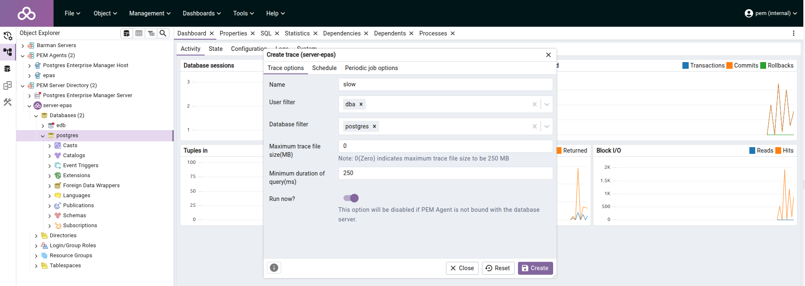
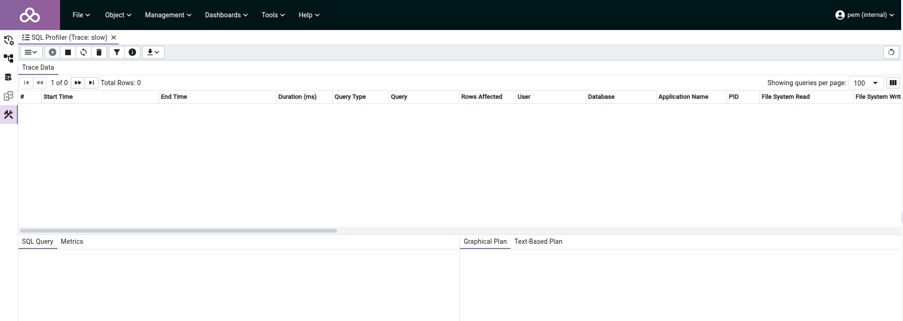
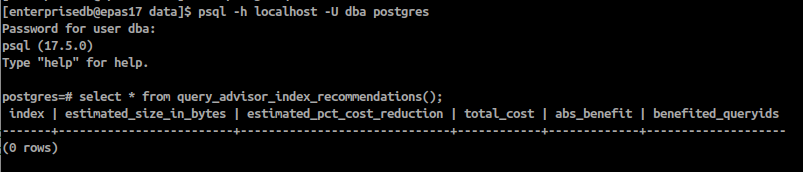
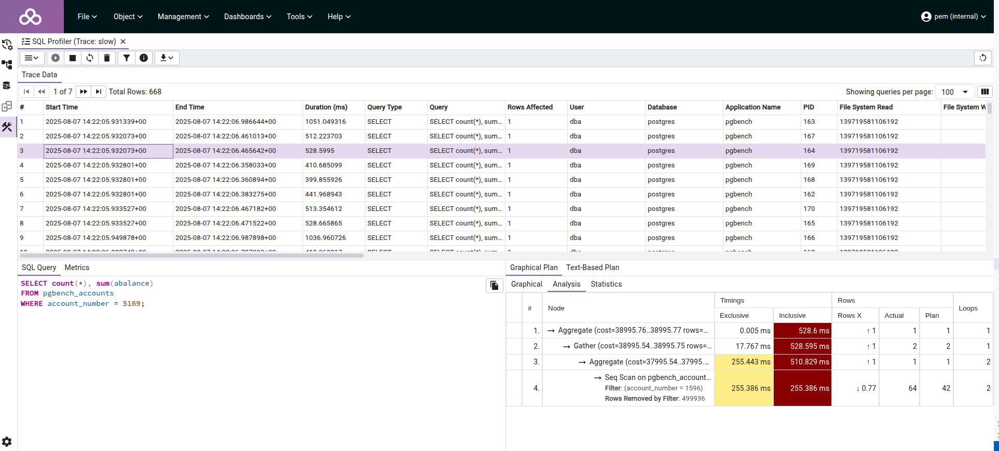
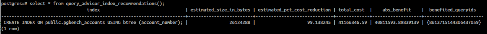

[](https://shields.io/)
[](https://GitHub.com/Naereen/StrapDown.js/graphs/commit-activity)

# Postgres Enterprise Manager (PEM)
## Components
- PEM 10 (Webapp + EPAS17 + PEM Agent)
- EPAS 17 (the monitored and managed database + PEM Agent)

## Goal
- In this demo, we will initialize PEM v10.1
- We will set up a Postgres Advanced 17 database and a PEM Agent - We will add extensions such as : 
  - sql_profiler
  - edb_wait_states
  - pg_stat_statements
  - system_stats
  - query_advisor
  - edb_pg_tuner

We will test SQL Profiler feature from PEM Server, using pgbench for tracking slow queries and get tips on how to optimize the SQL request by analyzing the execution plan ang get advices on index creation.

## EDB Repository Token
To install EPAS you need an access to EDB Repository.   
It is free, you can go to https://www.enterprisedb.com/docs/repos/ to read how to do.  
Create a file named .edbtoken and past your key into it  

## Start
We use vagrant to set up 2 VMs, one including PEM and another including Postgres Advanced 17. You can explore the bash file to reproduce the installation in your favorite automation tool.

```
vagrant up
```
Note that it is usefull to deregister your monitored Postgres instance with **05-unregister-pem-agent-epas.sh**

You can do it manually on your Postgres instance by running it as root. (the file is in /vagrant folder)

Note that when you just want to destroy your Postgress instance with vagrant, the agent will be automatically deregister from PEM.

```
vagrant destroy epas
```

## Access to PEM
Considering your setup with vagrant, you can access to PEM GUI : 
```
https://192.168.56.88:8443/pem/
```
login as pem/pem

You can explore all the features, and take a look to https://www.enterprisedb.com/docs/pem/latest/

## Running a workload with slow query
### Pgbench reminder
pgbench can perform load test based on a dataset related to transactional banking use case. We got 4 tables :  
- pgbench_branches : bank branches (default 1 row)
- pgbench_tellers : bank tellers (default 10 rows)
- pgbench_accounts : bank accounts (default 100000 rows)
- pgbench_history : log of completed transactions (0 row before lauching the load test)

1 -Create a database to store your 4 tables, you can use default postgres database.  
2 - Initialize DDL and data by running 
```
# -i or --initialize is an option to tell pgbench to create the DDL and the data
# -s or --scale is an option to multiply all the default 
number of rows for each table
# I specify that the targeted database name is postgres

pgbench -i -s 10 postgres
```

Then you can perform a load test by running 
```
# -c or --client specify the number of connexion to use
# -T or --time is the workload time duration in second

pgbench -c 10 -T 60 -h <server host> -U <user> <database>
```
The default workload is 
```sql
BEGIN;
UPDATE pgbench_accounts SET abalance = abalance + :delta WHERE aid = :aid;
SELECT abalance FROM pgbench_accounts WHERE aid = :aid;
UPDATE pgbench_tellers SET tbalance = tbalance + :delta WHERE tid = :tid;
UPDATE pgbench_branches SET bbalance = bbalance + :delta WHERE bid = :bid;
INSERT INTO pgbench_history (tid, bid, aid, delta, mtime)
  VALUES (:tid, :bid, :aid, :delta, CURRENT_TIMESTAMP);
END;
```
For a select only workload you can do 
```
# -S or --select-only change to a read workload
pgbench -S -c 10 -T 60 -h <server host> -U <user> <database>
```
The default select workload is 
```sql
SELECT abalance FROM pgbench_accounts WHERE aid = :aid.
```

### Slow query workload
You can make your own workload by using -f or --file option
```
# -j or --jobs is the number of threads used by pgbench on your machine

pgbench -h <host> -p <port> -U <user> -d <database> -f <workload.sql> -c 5 -j 4 -T 45
```
Here is the example of the workload workload-read-slow-request.sql which we will use in this demo
```sql
\set acc_number random(0, 10000)
SELECT count(*), sum(abalance)
FROM pgbench_accounts
WHERE account_number = :acc_number;
```

### Create your dataset
Initialize pgbench database
```
pgbench -h 192.168.56.90 -p 5444 -U dba -d postgres -i -s 10
```
Add a non indexed column and fill it
```
alter table pgbench_accounts add column account_number integer;
update pgbench_accounts set account_number = aid;
```
## PEM SQL Profiler trace
Important, the database to test must have the extensions mentionned previously.

1 - Go to https://192.168.56.88:8443/pem/ (pem/pem)  
2 - On the tree browser, Select PEM Server directory>server-epas>postgres  
3 - On the top menu select Tools>Server>SQL Profiler>Create Trace ...  
4 - Fill the form for a minimum duration query of 250ms
  
5 - Create the trace, then you go to SQL Profiler trace dashboard   

## Query advisor
On your EPAS instance : 
Query advisor extension comes with views and functions, here we use query_advisor_index_recommendations() function.
The behaviour is proactive, based on database statistics it recommand index on an empiric way. Here we don't start the workload so it is empty.

## Lauch the workload and track slow queries
```
pgbench -h 192.168.56.90 -p 5444 -U dba -d postgres -f workload-read-slow-request.sql -c 5 -j 4 -T 45
```
Take a look on your SQL Profiler trace :


We can see that a sequential scan is performed and it is the cause of the slow qury duration.
Note that 668 requests has been logged in the picture.

## Optimize the query execution
If you execute this query_advisor request, it suggests to create an index : 
```
select * from query_advisor_index_recommendations();
```


Create the recommended index :
```
CREATE INDEX ON public.pgbench_accounts USING btree (account_number);
```
Then reexecute pgbench and look at the trace SQL Profiler dashboard.
The number of logged requests should not increase.